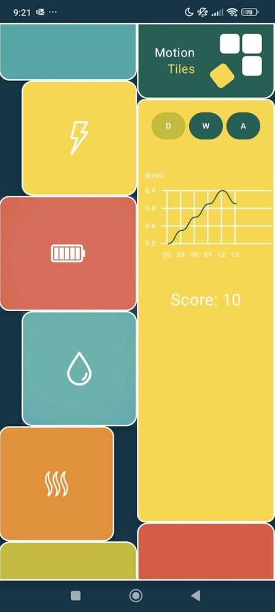
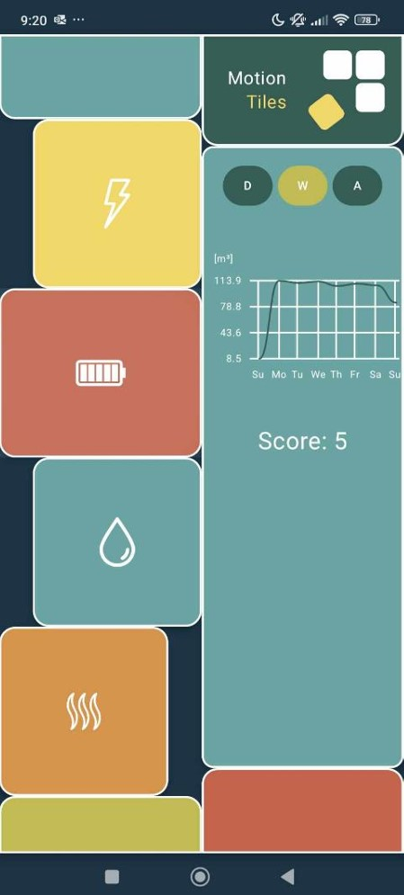
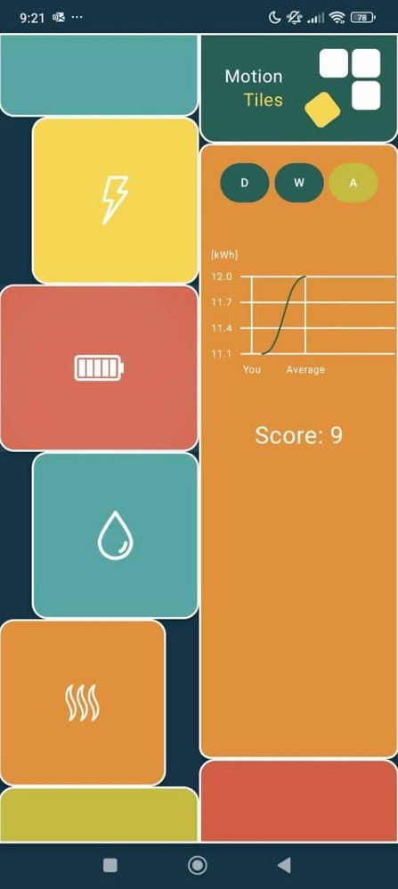

# Overview
This repository contains a demo Android mobile application designed to simulate a real-time interface for managing resource consumption in a smart home environment. The app was developed alongside physical interactive tiles and serves as a functional prototype to visualize and analyze energy, water, and heat usage.

# Features
- Real-time Interface Simulation – The app replicates the physical tile-based interface for interacting with energy, water, and heat consumption data.
- Category Selection – Users can choose between different categories (e.g., energy, water, heat), which updates the UI accordingly.
- Data Visualization – Interactive charts display consumption data in three modes:
  - Daily
  - Weekly
  - Average (compared to a model user)
- Dynamic UI Updates – Selected categories influence:
  - Background color of the main module
  - Highlighted button states for selected options
- Server Integration – The app connects to backend services, retrieving real consumption data from a database.

This demo was developed as part of a project integrating physical and digital interfaces to enhance smart home energy awareness.

# Views

    
   
    

